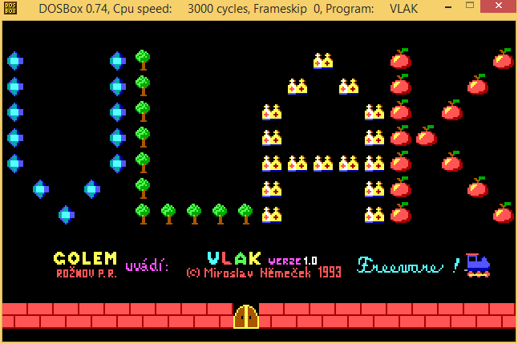

# Vlak

Game vlak.com from the legendary Czech author [Miroslav Němeček](https://github.com/oldcompcz/readme/wiki/Nemecek).

## How to build

First of all make sure you have correct environment:

* Make sure you have Turbo Assembler installed and you can run `tasm` and `tlink` at your computer.

Building steps:

1. Run `RUZNE.BAT` for RUZNE.SCR creation.
1. Run `VAGONY.BAT` for VAGONY.SCR creation.
1. Run `VECI.BAT` for VECI.SCR creation.
1. Finally run `A.BAT` which will put all together and will make VLAK.COM.

Original file VLAK.COM was compressed by 
[ProComp](http://panda38.sweb.cz/download/ProComp.zip) utility and 
protected againtst viruses by [Poj](http://panda38.sweb.cz/download/Poj.zip) 
utility.  

## How add new scene

1. Clone repository `git clone https://github.com/oldcompcz/vlak` 
1. Add new scene at the end of SCENY.ASM
1. Open VLAK.ASM and do following:
   1. Increase number of scenes at line 6
   1. Add password for new scene at the end of the file (at about line 1733)
1. Build project
